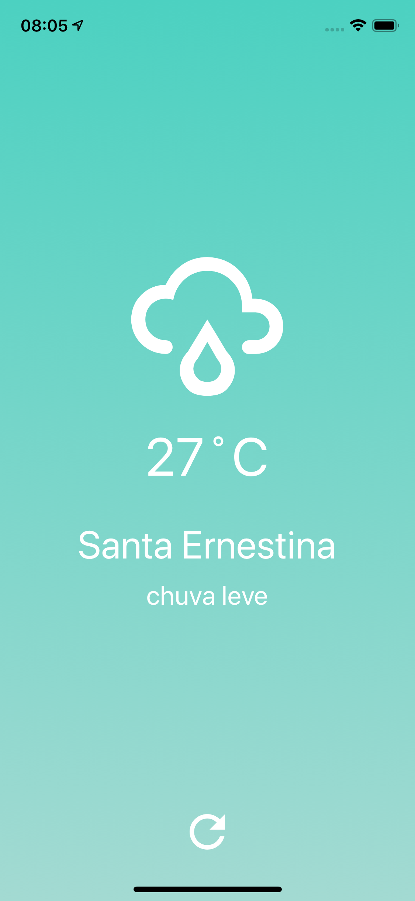

# App Clima
React Native Weather App using Open Weather Map API.


## Requirements
The following packages are required to run this application example:
* [Node.js (>=8.x.x)](https://nodejs.org)
* react-native CLI tool with a version equal to or above 2.0.1.

## Screen Shots
<p float="left">
    
    
</p>

## Setup

Primeiro, instale o [Yarn](https://yarnpkg.com):

```sh
# no MacOS
brew install yarn
```

## Installation

### 1. Clone this repository
First, clone this repository:

```bash
git clone git@github.com:edicarloslds/app-clima.git
```

### 2. Install the dependencies
Next, `cd` to the project directory and install all of the dependencies:

```bash
# Go to the project directory
cd app-clima

# Install all of the dependencies
yarn install
```

### 3. Set your Open Weather Map API key

Visit https://home.openweathermap.org/api_keys to fetch your API key.

Open the `src/utils/WeatherApiKey.js ` file then paste your Open Weather Map API key here:

```js
export const API_KEY = {MY_API_KEY};
```

### 4. Run the application 🚀

iOS:

```bash
yarn run ios
```

Android:

```bash
yarn run android
```

